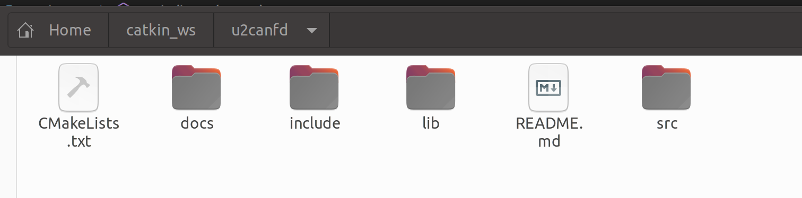
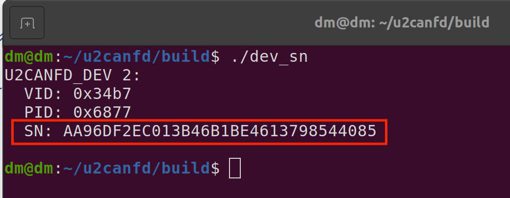
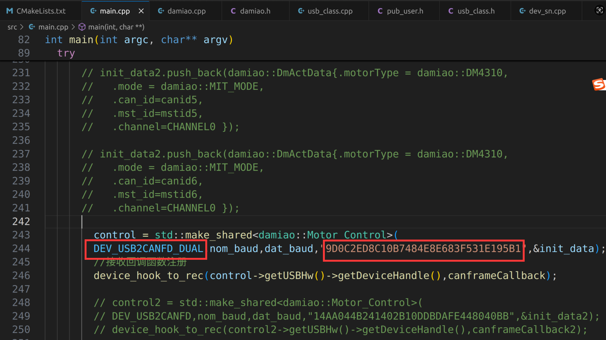

# 使用USB转CANFD驱动达妙电机，c++例程

## 介绍
这是控制达妙电机的c++例程。

硬件设备需要达妙的**USB转单路或者双路CANFD设备**。

程序测试环境是gcc13。

程序默认运行的效果是使用**USB转双路CANFD设备*先让canid为0x01、mstid为0x11的DM4310电机控制模式设置为MIT模式，然后使能，然后旋转，**电机波特率为5M**。

***注意：5M波特率下，电机有多个时，需要在末端电机接一个120欧的电阻***

## 软件架构
使用c++语言，没有用到ros

## 安装和编译

首先需要确保系统安装了libusb库，版本为**1.0.29**，版本不能低于这个。

然后打开终端，输入：
```shell
mkdir -p ~/catkin_ws
cd ~/catkin_ws
```
然后把gitee上的**u2canfd**文件夹放到catkin_ws目录下。

如下所示：



接着打开终端，输入：
```shell
cd ~/catkin_ws/u2canfd
mkdir build
cd build
cmake ..
make
```
## 简单使用
首先用最新上位机给电机设置5M波特率。

然后给**USB转CANFD设备**设置权限，在终端输入：
```shell
sudo nano /etc/udev/rules.d/99-usb.rules
```
然后写入内容：
```shell
SUBSYSTEM=="usb", ATTR{idVendor}=="34b7", ATTR{idProduct}=="6877", MODE="0666"
SUBSYSTEM=="usb", ATTR{idVendor}=="34b7", ATTR{idProduct}=="6632", MODE="0666"
```
第一行是USB转**单路**CANFD设备，第二行是第一行是USB转**双路**CANFD设备。

然后重新加载并触发：
```shell
sudo udevadm control --reload-rules
sudo udevadm trigger
```
***注意：这个设置权限只需要设置1次就行，重新打开电脑、插拔设备都不需要重新设置**

然后需要通过程序找到**USB转CANFD设备**的Serial_Number，在你刚刚编译的build文件夹中打开终端运行dev\_sn文件:
```shell
cd ~/catkin_ws/u2canfd/build
./dev_sn
```


上面图片里的SN后面的一串数字就是该设备的的Serial_Number，

接着复制该Serial\_Number，打开main.cpp，替换程序里的Serial\_Number，同时选择是**USB转单路CANFD**还是**双路CANFD**，如下图所示：



然后重新编译，打开终端输入：
```shell
cd ~/catkin_ws/u2canfd/build
make
```

在你刚刚编译的build文件夹中打开终端运行dm_main文件:
```shell
cd ~/catkin_ws/u2canfd/build
./dm_main
```
此时你会发现电机亮绿灯，并且旋转

## 默认电机配置

当前 `test.py` 默认配置 2 个电机：

- 电机 1：`can_id = 0x01`，`mst_id = 0x11`
- 电机 2：`can_id = 0x02`，`mst_id = 0x12`

默认电机型号为 `DM4310`，默认控制模式为 `VEL_MODE`。

##  新增电机型号

新增一款电机型号需要同时修改以下两个文件：

1. `damiao.h`：在 `DM_Motor_Type` 枚举中添加新型号。
2. `damiao.cpp`：在 `limit_param` 数组中添加对应的限位参数。


### 添加枚举类型

在 `damiao.h` 的 `DM_Motor_Type` 枚举中，在 `Num_Of_Motor` 之前添加新型号：

```cpp
enum DM_Motor_Type
{
    DM3507,
    DM4310,
    // ... 已有型号
    DMG6220,
    DMxxxx,       // 新增型号
    Num_Of_Motor
};
```

注意：新型号要加在 `Num_Of_Motor` 之前，并且不要插在已有型号中间，否则已有型号的下标会改变，`limit_param` 会对应错。

### 添加 limit_param

在 `damiao.cpp` 的 `limit_param` 数组末尾，按与枚举完全相同的顺序添加一组参数：

```cpp
Limit_param limit_param[Num_Of_Motor] =
{
    {12.566, 50, 5},     // DM3507
    {12.5, 30, 10},      // DM4310
    // ... 已有型号
    {12.5, 45, 10},      // DMG6220
    {Q_MAX, DQ_MAX, TAU_MAX},   // DMxxxx
};
```

`Q_MAX`、`DQ_MAX`、`TAU_MAX` 分别对应该电机的位置、速度、力矩限位，可在上位机查看或修改，不能填 `0`。

### 注意

- 漏改枚举会编译失败；漏改 `limit_param` 会导致限位参数缺失。
- 枚举顺序与 `limit_param` 顺序必须一一对应，不要插队或换序。
- 限位参数必须根据实际情况填写，不要填 `0`。
- 修改完成后重新编译：